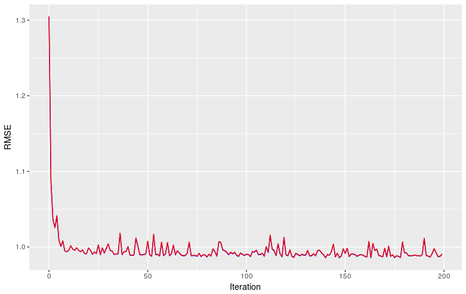

### C implementation of Stochastic Gradient Descent  

Stochastic Gradient Descent is one of the most basic ideas in Machine Learning, it is used as a model training method which allows the model to adjust its parameters through a number of iterations. The way this works is by creating a convex cost function, then we can 'descend' through its curve until we reach the global minimum. The cost function used depends on the problem (regression vs classification, for example). However, the objetive of this project is not to explain how Gradient Descent works, especially if we can learn it straight from [Stanford](http://ufldl.stanford.edu/tutorial/supervised/OptimizationStochasticGradientDescent/).  

My objective in this project is to implement Stochastic Gradient Descent in C. I will implement the basic Stochastic Gradient Descent and then some variants, such as ADAM and AMSGrad. Afterwards, I will implement this on CUDA (NVIDIA's GPGPU platform) for computing on the GPU, and make a performance comparison between the models. Some of the operations are done with the LAPACK library (which is written in FORTRAN and runs over BLAS). Documentation on the operations that is offers can be found [here](http://www.netlib.org/lapack/explore-html/index.html).   

## Data Used  

For this project, I will be using the flights database which I found in [Kaggle](https://www.kaggle.com/usdot/flight-delays), but apparently is produced by the US Department of Transportation. This database has over 5,000,000 records, which should be useful to prove the execution different between standard sequential and when programmed on CUDA. I have modified the variables slightly to be used with these models. The original variables where these:  

`YEAR,MONTH,DAY,DAY_OF_WEEK,AIRLINE,FLIGHT_NUMBER,TAIL_NUMBER,ORIGIN_AIRPORT,DESTINATION_AIRPORT,SCHEDULED_DEPARTURE,DEPARTURE_TIME,DEPARTURE_DELAY,TAXI_OUT,WHEELS_OFF,SCHEDULED_TIME,ELAPSED_TIME,AIR_TIME,DISTANCE,WHEELS_ON,TAXI_IN,SCHEDULED_ARRIVAL,ARRIVAL_TIME,ARRIVAL_DELAY,DIVERTED,CANCELLED,CANCELLATION_REASON,AIR_SYSTEM_DELAY,SECURITY_DELAY,AIRLINE_DELAY,LATE_AIRCRAFT_DELAY,WEATHER_DELAY`  

Using a pre-processing [script](preproc_flights.sh) the data is converted to these columns:  

`"TAXI_OUT" "SCHEDULED_TIME" "ELAPSED_TIME" "AIR_TIME" "DISTANCE" "MONTH..1" "MONTH.10" "MONTH.11" "MONTH.12" "MONTH..2" "MONTH..3" "MONTH..4" "MONTH..5" "MONTH..6" "MONTH..7" "MONTH..8" "MONTH..9" "DAY_OF_WEEK.1" "DAY_OF_WEEK.2" "DAY_OF_WEEK.3" "DAY_OF_WEEK.4" "DAY_OF_WEEK.5" "DAY_OF_WEEK.6" "DAY_OF_WEEK.7" "AIRLINE.AA" "AIRLINE.AS" "AIRLINE.B6" "AIRLINE.DL" "AIRLINE.EV" "AIRLINE.F9" "AIRLINE.HA" "AIRLINE.MQ" "AIRLINE.NK" "AIRLINE.OO" "AIRLINE.UA" "AIRLINE.US" "AIRLINE.VX" "AIRLINE.WN"`  

Our objective variable, which we'll try to predict, is 'departure delay'. The columns have also been scaled for faster convergence and avoidance of numeric errors.  

## Support libraries  
Two libraries were created to support execution of this program:   
  
* definitions.h, which has the structure definitions used by the program  
  
* functions.c, which contains frequently used functions  
  
The original files which these are built upon where written by my teacher, Erick Palacios. They have suffered some modifications for the implementation of these stochastic gradient descent methods.  

## Code  

```C
/*
Sequential Stochastic Gradient Descent
*/

#include <stdio.h>
#include <stdlib.h>
#include <string.h>
#include <math.h>
#include"definitions.h"
// Read data files (as preprocessed by code)
#define X_matrix "X_ent.txt" //size MxN
#define X_v_matrix "X_valida.txt" //size MxN
#define b_vector "b_bh.txt" //size Nx1
#define y_vector "y_train.txt" //size Mx1
#define y_v_vector "y_val.txt" //size Mx1


// FORTRAN (BLAS) function prototypes used for vector-matrix multiplication and scalar vector multiplication 
extern void dgemv_(char *transpose_a, int *m, int *n, double *alpha, double *a, int *lda, double *x, int *incx, double *beta, double *y, int *incy);
extern void daxpy_(int *n, double *a, double *x, int *incx, double *y, int *incy);

int main(int argc, char const *argv[]) {

  // Declaration of structures to store data
  array_2d_T X, X_v, batch;
	array_1d_T y, y_v, b, g, y_b, rmse, rmse_v;

  //Get data dimensions from standard input
  int M=atoi(argv[1]);
  int N=atoi(argv[2]);
  int M_v=atoi(argv[3]);
  // Read batch size
  int batch_size=atoi(argv[4]);
  // Read number of iterations
  int iter=atoi(argv[5]);
  // Read learning rate value
  double lr=atof(argv[6]);

	int incx=1;
  double ALPHA, BETA;


// Assign memory space for out data structures
  X=malloc(sizeof(*X));
  X_v=malloc(sizeof(*X_v));
  y=malloc(sizeof(*y));
  y_v=malloc(sizeof(*y_v));
  b=malloc(sizeof(*b));
  g=malloc(sizeof(*g));
  batch=malloc(sizeof(*batch));
  y_b=malloc(sizeof(*y_b));
  rmse=malloc(sizeof(*rmse));
  rmse_v=malloc(sizeof(*rmse_v));
// Assign dimension values for data structures
	rows(X)=M;
	columns(X)=N;
  rows(X_v)=M_v;
	columns(X_v)=N;
  rows_vector(b)=N;
	rows_vector(y)=M;
  rows_vector(y_v)=M_v;
  rows_vector(g)=N;
  rows(batch)=batch_size;
  columns(batch)=N;
  rows_vector(y_b)=batch_size;
  rows_vector(rmse)=iter;
  rows_vector(rmse_v)=iter;

// Firr our structures with our data from .txt files
	values(X)=malloc(rows(X)*columns(X)*sizeof(double));
	fill_matrix(X,X_matrix);

  values(X_v)=malloc(rows(X_v)*columns(X_v)*sizeof(double));
  fill_matrix(X_v,X_v_matrix);

	values_vector(b)=malloc(N*sizeof(double));
	fill_vector(b,b_vector);

  values_vector(y)=malloc(M*sizeof(double));
  fill_vector(y,y_vector);

  values_vector(y_v)=malloc(M_v*sizeof(double));
  fill_vector(y_v,y_v_vector);

	values_vector(g)=malloc(N*sizeof(double));

  values(batch)=malloc(rows(batch)*columns(batch)*sizeof(double));

  values_vector(y_b)=malloc(batch_size*sizeof(double));

  values_vector(rmse)=malloc(iter*sizeof(double));
  values_vector(rmse_v)=malloc(iter*sizeof(double));

// Start  iterations
for(int it = 0; it < iter; it++){ 
// Re-fill our response variable vectors every iteration as they get modified in each one (Details below)
  fill_vector(y,y_vector);
  fill_vector(y_v,y_v_vector);
  
  // Fill batch matrix. This step is what makes this algorithm stochastic as it randomly chooses a fixed number of records to train on every iteration
  fill_batch(batch, X, y_b, y);

// Calculate prediction error: e = - X %*% b + y
// Because of how dgemv function was programmed, vector y is overwrittten by result e (which is why we re-fill the y vector every iteration)
  ALPHA = -1.0;
  BETA = 1.0;
	dgemv_("No transpose", &batch_size, &N, &ALPHA, values(batch), &batch_size, values_vector(b), &incx, &BETA, values_vector(y_b),&incx);
  dgemv_("No transpose", &M, &N, &ALPHA, values(X), &M, values_vector(b), &incx, &BETA, values_vector(y),&incx);
  dgemv_("No transpose", &M_v, &N, &ALPHA, values(X_v), &M_v, values_vector(b), &incx, &BETA, values_vector(y_v),&incx);

// Calculation of the training and validation errors
  double acum = 0;
  for(int i = 0; i < M; i++){
    acum += pow(values_vector(y)[i],2);
  }
  double acum_v = 0;
  for(int i = 0; i < M_v; i++){
    acum_v += pow(values_vector(y_v)[i],2);
  }
  value_vector(rmse,it) = acum/M;
  value_vector(rmse_v,it) = acum_v/M_v;
  printf("Iteration %d/%d RMSE train: %lf -- RMSE val: %lf \n", it+1, iter, value_vector(rmse,it), value_vector(rmse_v,it));
  printf("------------\n");
// Calculating the gradient (for descent direction): g = -X^t %*% e
  ALPHA = -1.0;
  BETA = 0.0;
  dgemv_("Transpose", &batch_size, &N, &ALPHA, values(batch), &batch_size, values_vector(y_b), &incx, &BETA, values_vector(g),&incx);
// now vector g holds the gradient's value

// Update coefficients: b = b - lr * g
  daxpy_(&N, &lr,values_vector(g), &incx, values_vector(b), &incx);
}

printf("----- Final Coefficients -----\n");
print_vector(b);

// Save RMSE train and validation scores for later analysis.
FILE *f = fopen("RMSE_SGD.txt", "w");
if (f == NULL)
{
    printf("Error opening file!\n");
    exit(1);
}
  fprintf(f, "iteration,rmse_t,rmse_v\n");
  for(int i=0; i<iter; i++){
    fprintf(f, "%d,%f,%f\n", i, value_vector(rmse,i),value_vector(rmse_v,i));
  }
fclose(f);

// Free up memory allocated to structures
  free(values(X));
	free(X);
	free(values_vector(b));
	free(b);
  free(values_vector(y));
  free(y);
  free(values_vector(g));
  free(g);
  free(values(X_v));
  free(X_v);
  free(values_vector(y_v));
  free(y_v);
  free(values(batch));
  free(batch);
  free(values_vector(y_b));
  free(y_b);

	return 0;

}

```  

## Execution  
  
Compile:  

```
gcc -Wall SGD_sequential.c functions.c -o sgd.out -lblas -lm
```  
The '-lblas' flag indicates we want to make BLAS (LAPACK) functions available and the '-lm' flag indicates we want the maths library available.  

This command produces a sgd.out file, which we can then run using the following command:  

```
./sgd.out 3999805 39 1714203 256 200 -0.001
```    

This is equivalent to:  
```
./sgd.out <train_rows> <columns> <validation_rows> <batch_size> <number_of_iterations> <- learning_rate>
```    

In this first attempt I ran it for 200 iterations, which took 6 minutes and 20 seconds. The evolution of the RMSE through this process is shown next:  



## NEXT STEPS  

Implement ADAM and AMSGrad variations on sequential mode and compare results between them. Following, implement these same algorithms on CUDA C, the C language library extensions for processing on GPU. I expect a strong improvement in performance from this change. But we'll see!