This project consists on predicting the probability a credit card client
will default based on data from other customers from a bank in Taiwan.
The data was obtained from the [UCI
repository](https://archive.ics.uci.edu/ml/machine-learning-databases/00350/).

Loading and exploring dataset
-----------------------------

First, we will want to take a look at the dataset to see what we have:

    # Load the tidyverse library. It contains tools to load and clean/manipulate data
    library(tidyverse)
    library(ggplot2)
    # Load dataset and save it in a data frame object
    data <- readxl::read_xls("/home/daniel/Dropbox/Maestria Data Science/Semestre 1/Aprendizaje de Maquina/creditcarddefault/default_of_credit_card_clients.xls", col_names = TRUE) %>% as.data.frame()
    # Get dataframe dimension
    dim(data)

    ## [1] 30000    25

    # Column names
    colnames(data)

    ##  [1] "ID"                         "LIMIT_BAL"                 
    ##  [3] "SEX"                        "EDUCATION"                 
    ##  [5] "MARRIAGE"                   "AGE"                       
    ##  [7] "PAY_0"                      "PAY_2"                     
    ##  [9] "PAY_3"                      "PAY_4"                     
    ## [11] "PAY_5"                      "PAY_6"                     
    ## [13] "BILL_AMT1"                  "BILL_AMT2"                 
    ## [15] "BILL_AMT3"                  "BILL_AMT4"                 
    ## [17] "BILL_AMT5"                  "BILL_AMT6"                 
    ## [19] "PAY_AMT1"                   "PAY_AMT2"                  
    ## [21] "PAY_AMT3"                   "PAY_AMT4"                  
    ## [23] "PAY_AMT5"                   "PAY_AMT6"                  
    ## [25] "default payment next month"

We know that our dataset consists of 30,000 records with 25 columns. The
columns are the following (according to accompanying documentation on
website):

-   ID

-   Limit balance (credit amount in taiwanese dollars)

-   Gender (1=male; 2=female)

-   Level of education (1 = graduate school; 2 = university; 3 = high
    school; 4 = others)

-   Marital status (1 = married; 2 = single; 3 = others)

-   Age (in years)

-   PAY\_0 through PAY\_6 indicate the payment status over the last 6
    months. (-1 = pay duly; 1 = payment delay for one month; 2 = payment
    delay for two months; ...; 8 = payment delay for eight months; 9 =
    payment delay for nine months and above)

-   BILL\_AMT1 through BILL\_AMT6 (remaining amount in bill for each of
    the last six months)

-   PAY\_AMT\_1 through PAY\_AMT6 (amount paid in each bill over the
    last six months)

-   Indicator variable for default on the following month. (this is our
    variable of interest, which we will want to predict)

We can then take a first preview of the data:

    # Print first few lines of dataset
    head(data)

    ##   ID LIMIT_BAL SEX EDUCATION MARRIAGE AGE PAY_0 PAY_2 PAY_3 PAY_4 PAY_5
    ## 1  1     20000   2         2        1  24     2     2    -1    -1    -2
    ## 2  2    120000   2         2        2  26    -1     2     0     0     0
    ## 3  3     90000   2         2        2  34     0     0     0     0     0
    ## 4  4     50000   2         2        1  37     0     0     0     0     0
    ## 5  5     50000   1         2        1  57    -1     0    -1     0     0
    ## 6  6     50000   1         1        2  37     0     0     0     0     0
    ##   PAY_6 BILL_AMT1 BILL_AMT2 BILL_AMT3 BILL_AMT4 BILL_AMT5 BILL_AMT6
    ## 1    -2      3913      3102       689         0         0         0
    ## 2     2      2682      1725      2682      3272      3455      3261
    ## 3     0     29239     14027     13559     14331     14948     15549
    ## 4     0     46990     48233     49291     28314     28959     29547
    ## 5     0      8617      5670     35835     20940     19146     19131
    ## 6     0     64400     57069     57608     19394     19619     20024
    ##   PAY_AMT1 PAY_AMT2 PAY_AMT3 PAY_AMT4 PAY_AMT5 PAY_AMT6
    ## 1        0      689        0        0        0        0
    ## 2        0     1000     1000     1000        0     2000
    ## 3     1518     1500     1000     1000     1000     5000
    ## 4     2000     2019     1200     1100     1069     1000
    ## 5     2000    36681    10000     9000      689      679
    ## 6     2500     1815      657     1000     1000      800
    ##   default payment next month
    ## 1                          1
    ## 2                          1
    ## 3                          0
    ## 4                          0
    ## 5                          0
    ## 6                          0

Data exploration and cleaning
=============================

By convention, it is suggested to work with variable names in lowercase
and with an underscore instead of spaces. We will correct this next:

    names(data) <- names(data) %>% tolower() %>% stringr::str_replace_all(.," ","_")
    colnames(data)

    ##  [1] "id"                         "limit_bal"                 
    ##  [3] "sex"                        "education"                 
    ##  [5] "marriage"                   "age"                       
    ##  [7] "pay_0"                      "pay_2"                     
    ##  [9] "pay_3"                      "pay_4"                     
    ## [11] "pay_5"                      "pay_6"                     
    ## [13] "bill_amt1"                  "bill_amt2"                 
    ## [15] "bill_amt3"                  "bill_amt4"                 
    ## [17] "bill_amt5"                  "bill_amt6"                 
    ## [19] "pay_amt1"                   "pay_amt2"                  
    ## [21] "pay_amt3"                   "pay_amt4"                  
    ## [23] "pay_amt5"                   "pay_amt6"                  
    ## [25] "default_payment_next_month"

Afterwards, we can verify whether or not we have missing values in the
dataset:

    data %>% apply(.,2,is.na) %>% apply(.,2,sum)

    ##                         id                  limit_bal 
    ##                          0                          0 
    ##                        sex                  education 
    ##                          0                          0 
    ##                   marriage                        age 
    ##                          0                          0 
    ##                      pay_0                      pay_2 
    ##                          0                          0 
    ##                      pay_3                      pay_4 
    ##                          0                          0 
    ##                      pay_5                      pay_6 
    ##                          0                          0 
    ##                  bill_amt1                  bill_amt2 
    ##                          0                          0 
    ##                  bill_amt3                  bill_amt4 
    ##                          0                          0 
    ##                  bill_amt5                  bill_amt6 
    ##                          0                          0 
    ##                   pay_amt1                   pay_amt2 
    ##                          0                          0 
    ##                   pay_amt3                   pay_amt4 
    ##                          0                          0 
    ##                   pay_amt5                   pay_amt6 
    ##                          0                          0 
    ## default_payment_next_month 
    ##                          0

And we have no missing values.

We can then do some exploration to understand how our variables behave:

### Limit balance

    hist(data$limit_bal, main = "Histogram of loan amount", xlab = "Loan amount")

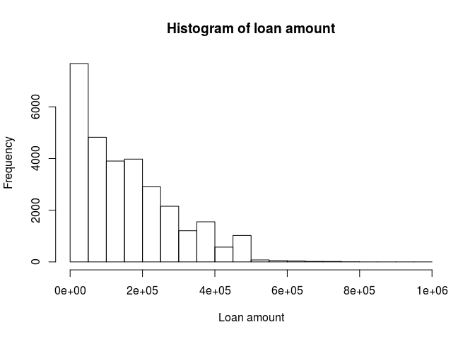

Most of the loans belong to the lower end of the spectrum.

    data$limit_bal %>% mean()

    ## [1] 167484.3

    data$limit_bal %>% quantile()

    ##      0%     25%     50%     75%    100% 
    ##   10000   50000  140000  240000 1000000

Our mean loan amount is 167,500 Taiwanese dollars and half of the loans
were under 140,000 dollars. The maximum loan was for 1,000,000 taiwanese
dollars.

### Sex

    # change coding to 0 and 1 where now female = 0 and male = 1
    data$sex <- ifelse(data$sex == 2, 0,1)

    prop.table(table(data$sex))

    ## 
    ##         0         1 
    ## 0.6037333 0.3962667

We can see that the majority of loanees are female, making up 60% of the
list. Males make up the remanining 40%.

### Education

    data$education %>% table %>% prop.table() %>% plot()

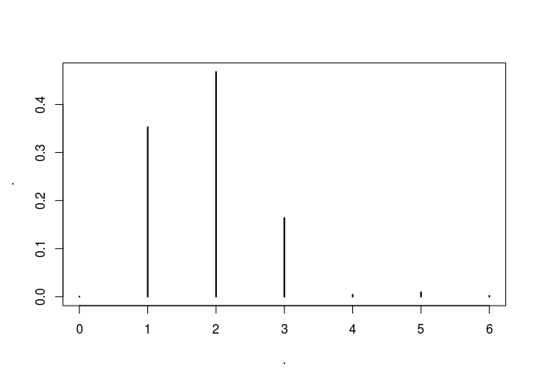

From the plot we can see that we have more groups than were promised in
the database description. We could maybe try to infer what they are, but
since we can't be sure as we cannot ask anyone, well group 0, 5 and 6
into group 4, which already represents 'others'.

    data$education <- ifelse(data$education %in% c(0,5,6), 4, data$education)
    data$education %>% table %>% prop.table()

    ## .
    ##         1         2         3         4 
    ## 0.3528333 0.4676667 0.1639000 0.0156000

From the previous table we can observe that this bank has given loans
mainly to people with a univeristy degree, followed by people with a
graduate degree and then people with a high school degree. It seems to
work mainly with highly educated people.

### Marriage

    data$marriage %>% table()

    ## .
    ##     0     1     2     3 
    ##    54 13659 15964   323

Again, with marriage we have more groups than were described, so we will
add the observations with a '0' to group '3'.

    data$marriage <- ifelse(data$marriage == 0, 3, data$marriage)
    data$marriage %>% table %>% prop.table()

    ## .
    ##          1          2          3 
    ## 0.45530000 0.53213333 0.01256667

Customers seem to be pretty evenly divided between married and single.
'Others' represents only 1.2 percent of the data.

### Age

    data$age %>% hist(., main = "Histogram of age", xlab = "Age")

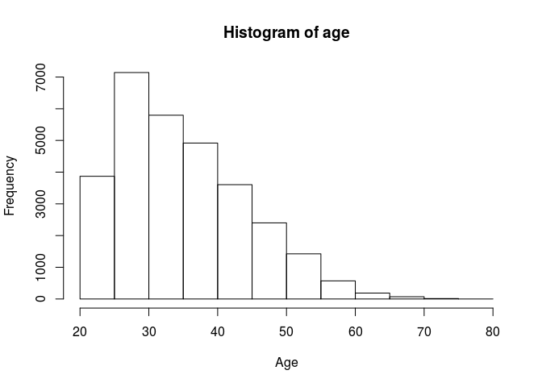

Customers mainly belong to the 'young adult' (between 25 and 40) segment
of the population.

### PAY\_0 to PAY\_6

    ggplot(data = data %>% gather(c(7:12), key = "month", value = "pay")) + geom_histogram(aes(x=pay)) + facet_grid(~month) + theme_bw()

    ## `stat_bin()` using `bins = 30`. Pick better value with `binwidth`.

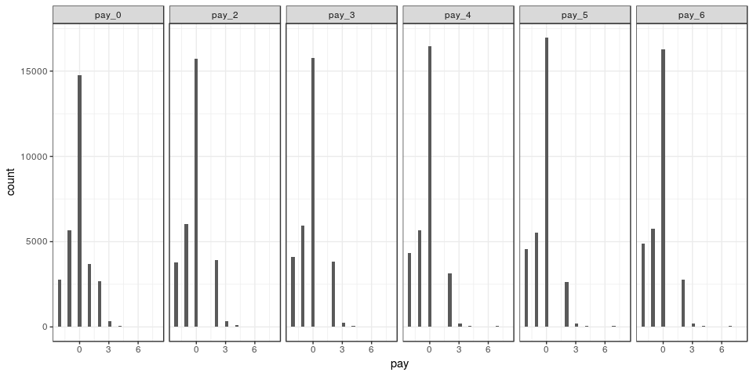

From the previous tables, we can see that most customers pay duly (on
time) and then quite a few also pay one or two months early. There is
another spike with customers who pay 3 months late, and very few
customers pay over three months late.

### Pay amount

    ggplot(data = data %>% gather(c(19:24), key = "month", value = "pay")) + geom_histogram(aes(x=pay)) + facet_grid(~month) + xlim(c(0,150000)) + ylim(c(0,10000)) + theme_bw()

    ## `stat_bin()` using `bins = 30`. Pick better value with `binwidth`.

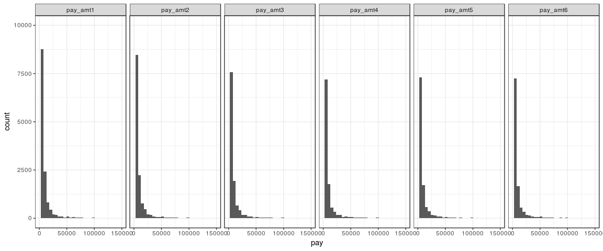

As we can see, most customers make low payments towards their loan.
However, this must be directly related to the initial amount of their
loan, so it might be interesting to add a variable equivalent to the
proportion of the full initial loan paid. I have changed the plot limits
to avoid a bad formatting of the plots due to outliers.

### Credit default

    data$default_payment_next_month %>% table() %>% prop.table()

    ## .
    ##      0      1 
    ## 0.7788 0.2212

Apparently, about 22% of the clients in the database defaulted. We can
explore some variable interactions with the objective to see if maybe we
can start seeing a trend:

    data[,c(3,25)] %>% table() %>% prop.table() %>% plot()

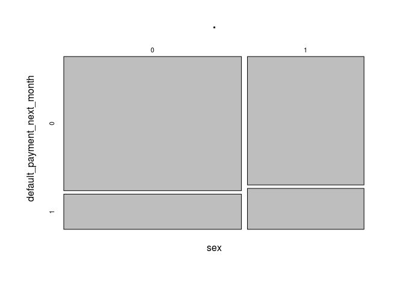

Regarding gender, men tend to default more than women (12.5% vs 9.6%
respectively).

    data[,c(4,25)] %>% table() %>% prop.table() %>% plot()

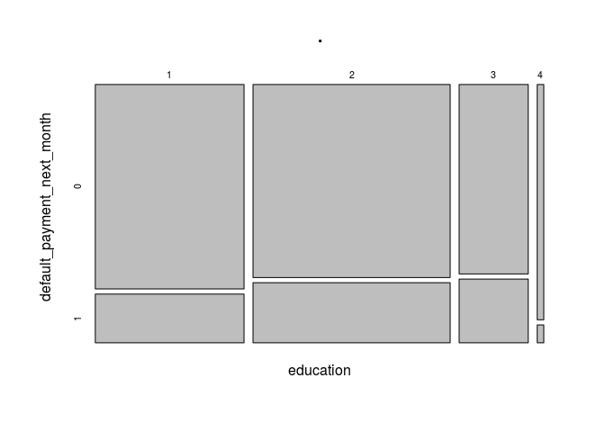

Proportionately, clients belonging to the 'others' category default
significantly less that the others, however, there are far less clients
belonging to this category than the others (468 out of the 30,000),
which could mean its down to 'luck'. There seems to be a trend where
less educated people start defaulting more (1 is clients with graduate
education, 3 is clients with highschool only).

    data[,c(5,25)] %>% table() %>% prop.table() %>% plot()

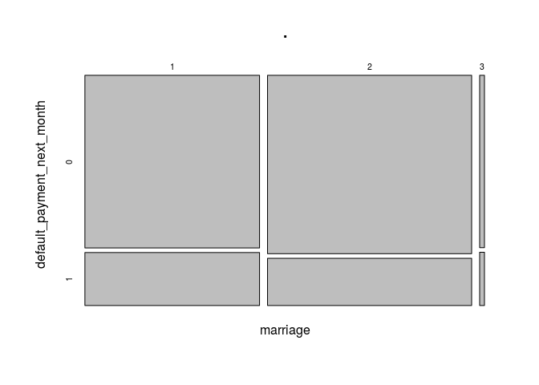

Can't see a big difference among marital status groups, although the
proportion of singles who have defaulted has historically been slighlt
lower than married couples.

Feature engineering
===================

Since we have several categorical variables, it would be a good idea to
convert them to dummy variables. We can use the One Hot Encoding
(onehot) library to achieve this. But before, we must convert our
categorical variables to factor type:

    library(onehot)

    # sex is a categorial variable but is already formatted as dummy
    data$education <- data$education %>% as.factor()
    data$marriage <- data$marriage %>% as.factor()
    data$pay_0 <- data$pay_0 %>% as.factor()
    data$pay_2 <- data$pay_2 %>% as.factor()
    data$pay_3 <- data$pay_3 %>% as.factor()
    data$pay_4 <- data$pay_4 %>% as.factor()
    data$pay_5 <- data$pay_5 %>% as.factor()
    data$pay_6 <- data$pay_6 %>% as.factor()

    data_onehot <- onehot(data, max_levels = 15)

    data_cat <- predict(data_onehot,data) %>% as.data.frame()

Afterwards, we can separate our data into train and test sets.

    set.seed(138176)
    data_cat$unif <- runif(nrow(data_cat))
    data_or <- data_cat %>% arrange(unif)
    data_or <- data_cat %>% select(-unif)
    split_train <- nrow(data_or)*0.6
    split_val <- nrow(data_or)*0.8

    X_train <- data_or[1:split_train,] %>% select(-default_payment_next_month, -id) %>% as.matrix()
    y_train <- data_or$default_payment_next_month[1:split_train]

    X_val <- data_or[(split_train+1):split_val,] %>% select(-default_payment_next_month, -id) %>% as.matrix()
    y_val <- data_or$default_payment_next_month[(split_train+1):split_val]

    X_test <- data_or[(split_val+1):nrow(data_or),] %>% select(-default_payment_next_month, -id) %>% as.matrix()
    y_test <- data_or$default_payment_next_month[(split_val+1):nrow(data_or)]
    rm(data, data_or)

    prop.table(table(y_train))

    ## y_train
    ##         0         1 
    ## 0.7694444 0.2305556

    prop.table(table(y_val))

    ## y_val
    ##         0         1 
    ## 0.7966667 0.2033333

We can see that we have achieved to mantain a similar distribution of
defaulted customers to the original, which is important to make sure we
train our model correctly and not under or over represent defaulted
customers. It is important to remember that out objective in this
project is to devise a model to predict which loans are more prone to
default. In this sense, it might be in the bank's best interest to try
and identify all loans with default even if this means we will have more
false positives (denying loans because they were classified as prone to
default when they actually wouldn't have defaulted).

Logistic regression with regularization
---------------------------------------

I will implement a logistic regression using the glmnet library

    library(glmnet)

    glm_model <- cv.glmnet(X_train, y_train, family = "binomial", alpha = 1, lambda = exp(seq(-10,0,1)), nfolds =10)
    plot(glm_model)

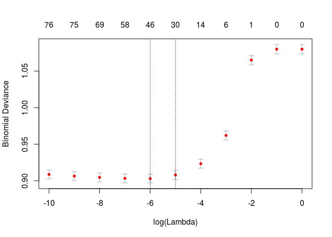

    preds_val_log <- predict(glm_model, newx = X_val)
    print("Confusion Matrix")

    ## [1] "Confusion Matrix"

    prop.table(table(preds_val_log > 0.5, y_val),2)

    ##        y_val
    ##                  0          1
    ##   FALSE 0.98410042 0.80819672
    ##   TRUE  0.01589958 0.19180328

In this case, and using Lasso regularization to reduce our model's
compexity, we obtain a model which is much better at identifying
non-default loans than defaulting loans, which is opposite to our main
objetive.

Random Forest
-------------

    library(randomForest)

    ## randomForest 4.6-14

    ## Type rfNews() to see new features/changes/bug fixes.

    ## 
    ## Attaching package: 'randomForest'

    ## The following object is masked from 'package:dplyr':
    ## 
    ##     combine

    ## The following object is masked from 'package:ggplot2':
    ## 
    ##     margin

    rand_forest <-tuneRF(X_train, factor(y_train), ntree = 300, stepFactor = 1.3, doBest = TRUE)

    ## mtry = 9  OOB error = 19.02% 
    ## Searching left ...
    ## mtry = 7     OOB error = 19.18% 
    ## -0.00817757 0.05 
    ## Searching right ...
    ## mtry = 11    OOB error = 19.19% 
    ## -0.008761682 0.05

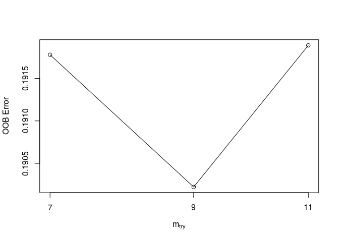

    preds_val_rf <- predict(rand_forest, type = "prob", newdata = X_val)
    print("Confusion Matrix")

    ## [1] "Confusion Matrix"

    prop.table(table(preds_val_rf[,2] > 0.5, y_val),2)

    ##        y_val
    ##                  0          1
    ##   FALSE 0.96401674 0.64590164
    ##   TRUE  0.03598326 0.35409836

The random forest tuning function found that the optimal number of
variables to use in each branch was 9, as it produces the lowest out of
bag error. This model produces a much better confusion matrix according
to out objective. It accurately classified 35% of the defaulting loans
as defaulted on the validation data.

Gradient Boosting Models
------------------------

    library(xgboost)

    ## 
    ## Attaching package: 'xgboost'

    ## The following object is masked from 'package:dplyr':
    ## 
    ##     slice

    d_entrena <- xgb.DMatrix(X_train, label = y_train) 
    d_valida <- xgb.DMatrix(X_val, label = y_val) 
    watchlist <- list(eval = d_valida, train = d_entrena)
    params <- list(booster = "gbtree",
                   max_depth = 3, 
                   eta = 0.03, 
                   nthread = 8, 
                   subsample = 0.75, 
                   lambda = 0.001,
                   objective = "binary:logistic", 
                   eval_metric = "error")
    bst <- xgb.train(params, d_entrena, nrounds = 300, watchlist = watchlist, verbose=0)

    preds_val_bst <- predict(bst, newdata = X_val)
    print("Confusion matrix")

    ## [1] "Confusion matrix"

    prop.table(table(preds_val_bst > 0.5, y_val),2)

    ##        y_val
    ##                  0          1
    ##   FALSE 0.96276151 0.63114754
    ##   TRUE  0.03723849 0.36885246

Finally, the boosting model seems slightly better than the random forest
at classifying defaulted loans as defaults.

Models evaluation:
==================

    library(ROCR)

    ## Loading required package: gplots

    ## 
    ## Attaching package: 'gplots'

    ## The following object is masked from 'package:stats':
    ## 
    ##     lowess

    pred_rocr <- prediction(preds_val_log, y_val) 
    perf <- performance(pred_rocr, measure = "sens", x.measure = "fpr") 
    graf_roc_log <- data_frame(tfp = perf@x.values[[1]], sens = perf@y.values[[1]], 
                           d = perf@alpha.values[[1]])

    pred_rocr <- prediction(preds_val_rf[,2], y_val) 
    perf <- performance(pred_rocr, measure = "sens", x.measure = "fpr") 
    graf_roc_rf <- data_frame(tfp = perf@x.values[[1]], sens = perf@y.values[[1]], 
                           d = perf@alpha.values[[1]])

    pred_rocr <- prediction(preds_val_bst, y_val) 
    perf <- performance(pred_rocr, measure = "sens", x.measure = "fpr") 
    graf_roc_bst <- data_frame(tfp = perf@x.values[[1]], sens = perf@y.values[[1]], 
                           d = perf@alpha.values[[1]])

    graf_roc_log$model <- 'Logistic Regression'
    graf_roc_rf$model <- 'Random Forest'
    graf_roc_bst$model <- 'Boosting'
    graf_roc <- bind_rows(graf_roc_log, graf_roc_rf, graf_roc_bst)

    ggplot(graf_roc, aes(x = tfp, y = sens, colour = model)) + geom_point() +
      xlab('1-Specificity') + ylab('Sensitivity') 

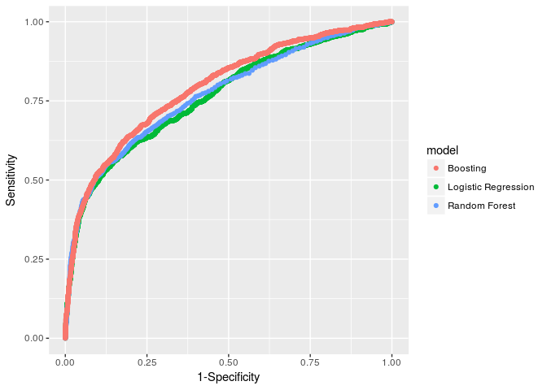

Using the ROC curve, we can confirm what we observed with the confusion
matrices. The Boosting model is better than the other two as it achieves
a greater area under curve, and seems to be specifically better under
the sensitivity matrix, which is our main objetive. It might be
interesting to change our 'cutoff value' to define if a customer should
be classified as default or not, while maintaining a good balance with
those who are classified as not-defaulted. We can do this with the
confusion matrix previously reviewed.

It all depends on the business rules the bank works with, but since in
this case I cannot communicate with the bank, I would suggest using the
following 'cutoff probability'. Why? This way we correctly classify
about 50% of the defaulting loanees, while only 'losing' 10% of the
non-defaulting. And, instead of losing them, a strategy to futher
analyze those specific cases/applications could be defined.

    print("Confusion matrix - Boosting")

    ## [1] "Confusion matrix - Boosting"

    prop.table(table(preds_val_bst > 0.32, y_val),2)

    ##        y_val
    ##                  0          1
    ##   FALSE 0.90062762 0.47950820
    ##   TRUE  0.09937238 0.52049180

Thus, we will use the Boosting model to predict on our test set and see
how it performs:

    preds_val_bst <- predict(bst, newdata = X_test)
    print("Confusion matrix")

    ## [1] "Confusion matrix"

    prop.table(table(preds_val_bst > 0.32, y_test),2)

    ##        y_test
    ##                  0          1
    ##   FALSE 0.90409801 0.49289100
    ##   TRUE  0.09590199 0.50710900

The final result was consistent with what was observed with the
validation data. We can conclude that this model is correctly learning
from the data fed to it and that it could prove useful for use in the
bank's loan application decisions. It has the potential to reduce costs
by helping the bank avoid giving out loans to customers who will default
on them.
